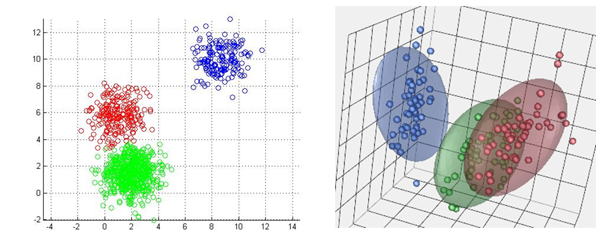

# Clusters



## About

Clusters identifies clusters in data using the k-means algorithm implemented in JavaScript. For more on K-means, check out this <a href="http://cs229.stanford.edu/notes/cs229-notes7a.pdf">blog post.</a>

## Installation

`npm install clusters --save`

## Documentation & Example

```javascript
var clusterMaker = require('clusters');

//number of clusters, defaults to undefined
clusterMaker.k(3);

//number of iterations (higher number gives more time to converge), defaults to 1000
clusterMaker.iterations(750);

//data from which to identify clusters, defaults to []
clusterMaker.data([[1, 0], [0, 1], [0, 0], [-10, 10], [-9, 11], [10, 10], [11, 12]]);

console.log(clusterMaker.clusters());

// { centroid: [10.5 , 11], points: [[10, 10], [11, 12]] },
// { centroid: [-9.5, 10.5], points: [[-10, 10], [-9, 11]] },
// { centroid: [0.3333333333333333, 0.3333333333333333], points: [[1, 0], [0, 1], [0, 0]] }

```

## Testing

`npm test`

## License

**The MIT License (MIT)**

> Copyright (c) 2015 Nathan Epstein
>
> Permission is hereby granted, free of charge, to any person obtaining a copy
> of this software and associated documentation files (the "Software"), to deal
> in the Software without restriction, including without limitation the rights
> to use, copy, modify, merge, publish, distribute, sublicense, and/or sell
> copies of the Software, and to permit persons to whom the Software is
> furnished to do so, subject to the following conditions:
>
> The above copyright notice and this permission notice shall be included in
> all copies or substantial portions of the Software.
>
> THE SOFTWARE IS PROVIDED "AS IS", WITHOUT WARRANTY OF ANY KIND, EXPRESS OR
> IMPLIED, INCLUDING BUT NOT LIMITED TO THE WARRANTIES OF MERCHANTABILITY,
> FITNESS FOR A PARTICULAR PURPOSE AND NONINFRINGEMENT. IN NO EVENT SHALL THE
> AUTHORS OR COPYRIGHT HOLDERS BE LIABLE FOR ANY CLAIM, DAMAGES OR OTHER
> LIABILITY, WHETHER IN AN ACTION OF CONTRACT, TORT OR OTHERWISE, ARISING FROM,
> OUT OF OR IN CONNECTION WITH THE SOFTWARE OR THE USE OR OTHER DEALINGS IN
> THE SOFTWARE.

